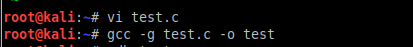
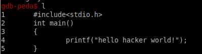
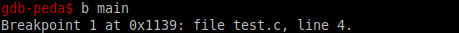
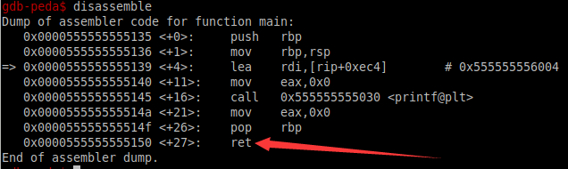
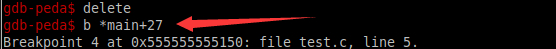
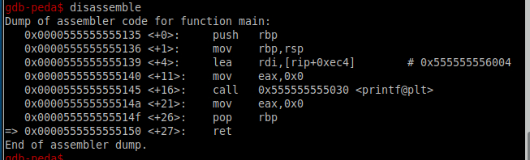
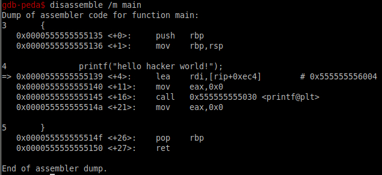
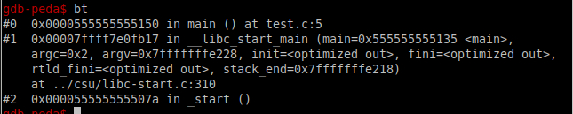
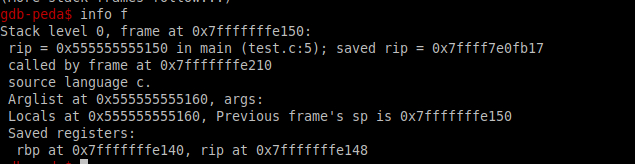
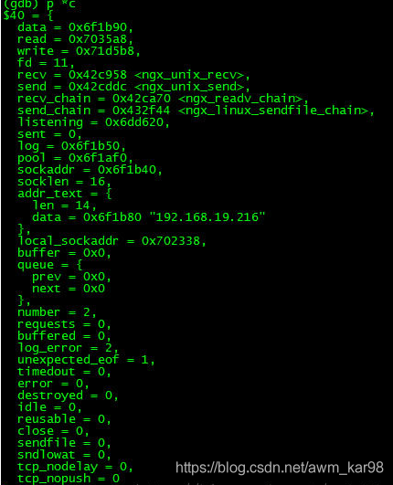

# gdb调试工具


## **1.什么是GDB，能干啥?**

 gdb是GNU开源组织发布的一个强大的Linux下的程序调试工具。

 一般来说，GDB主要帮助你完成下面四个方面的功能：

1、启动你的程序，可以按照你的自定义的要求随心所欲的运行程序。

2、可让被调试的程序在你所指定的调置的断点处停住。（断点可以是条件表达式）

3、当程序被停住时，可以检查此时你的程序中所发生的事。

4、你可以改变你的程序，将一个BUG产生的影响修正从而测试其他BUG。

## **2.GDB调试的对象**

 GDB主要来调试C/C++语言写的程序，当然也就可以调试其他语言程序。这里我们只说C/C++(其他语言我也不会呀)
GDB调试一定要是可执行文件而不是.c文件
要用gcc进行编译，具体的命令如下：

```
gcc -g 源文件.c -o 输出的目标文件
```

-g,-o参数缺一不可



## **3.GDB常用的调试命令**


`（gdb）help`：查看命令帮助，具体命令查询在gdb中输入help + 命令,简写h

`（gdb）run`：重新开始运行文件（run-text：加载文本文件，run-bin：加载二进制文件）,简写r

`（gdb）start`：单步执行，运行程序，停在第一执行语句

`（gdb）list`：查看原代码（list-n,从第n行开始查看代码。list+ 函数名：查看具体函数）,简写l

`（gdb）set`：设置变量的值

`（gdb）next`：单步调试（逐过程，函数直接执行）,简写n

`（gdb）step`：单步调试（逐语句：跳入自定义函数内部执行）,简写s

`（gdb）backtrace`：查看函数的调用的栈帧和层级关系,简写bt

`（gdb）frame`：切换函数的栈帧,简写f

`（gdb）info`：查看函数内部局部变量的数值,简写i

`（gdb）finish`：结束当前函数，返回到函数调用点

`（gdb）continue`：继续运行,简写c

`（gdb）print`：打印值及地址,简写p

`（gdb）quit`：退出gdb,简写q

`（gdb）break+num`：在第num行设置断点,简写b

`（gdb）info breakpoints`：查看当前设置的所有断点

`（gdb）delete breakpoints num`：删除第num个断点,简写d

`（gdb）display`：追踪查看具体变量值

`（gdb）undisplay`：取消追踪观察变量

`（gdb）watch`：被设置观察点的变量发生修改时，打印显示

`（gdb）i watch`：显示观察点

`（gdb）enable breakpoints`：启用断点

`（gdb）disable breakpoints`：禁用断点

`（gdb）x`：查看内存x/20xw 显示20个单元，16进制，4字节每单元

`（gdb）run argv[1] argv[2]`：调试时命令行传参

以上就是GDB的命令其中的部分，下面列详细写一些基础常用的命令：
 **`list` **
`list` 可写为`l`,可以列出所调试程序的代码

1.`list+linenumber`
可以列出linenumber附近的代码
2.`list function`
可以列出函数上下文的源程序

```
run&quit
1
```

在GDB中如何将程序运行起来，此时只要输入run命令,就可以将命令跑起来
而quit则是退出GDB调试
**`break`**


gdb调试时使用break命令来设置断点，有如下几种下断点地方法

```
break < function > 
1
```

在进入指定的函数function时既停止运行，C++中可以使用class::function或function(type, type)格式来指定函数名称

```
break < lineNumber> 
1
```

在指定的代码行打断点

```
break +offset/break -offset 
1
```

在当前行的前面或后面的offset行打断点，offset为自然数

```
break filename:lineNumber 
1
```

在名称为filename的文件中的第lineNumber行打断点

```
break filename:function 
1
```

在名称为filename的文件中的function函数入口处打断点

```
break *address 
1
```

在程序运行的内存地址处打断点

```
break 
1
```

在下一条命令处停止运行

```
break … if < condition> 
1
```

在处理某些循环体中可使用此方法进行调试，其中…可以是上述的`break lineNumber`、

`break +offset/break -offset`中的参数，其中`condition`表示条件，在条件成立时程
序即停止运行，如设置`break if i=100`表示当i为100时程序停止运行。

查看断点时，也可以使用`info`命令如`info breakpoints [n]、info break [n]`其中`n` 表示断点号来查看断点信息。

可以通过`delete`命令删除所有的断点
**`next`**
使用next命令单步执行程序代码，next的单步不会进入函数的内部，与next对应的step命令则在单步执行一个函数时进入函数内部，类似于VC++中的step into.
其用法如下

```
next <count> 
1
```

单步跟踪，如果有函数调用不会进入函数，如果后面不加count表示一条一条的执行，加count表示执行后面的count条指令

```
continue
1
```

当程序遇到断点停下来之后，可以执行continue继续执行到下一个断点或到程序结束

```
print

print可以缩写为p，可以通过print命令查看参数或程序运行数据
123
```

值得注意的是print输出可以指定输出格式：

```
x按16进制格式显示变量

d按十进制显示变量

u按十六进制格式显示无符号整形

o按八进制格式显示变量

t按二进制格式显示变量

c按字符格式显示变量

f按浮点数格式显示变量 
12345678910111213
```

**GDB查看，执行汇编语言
查看汇编 `disassemble`**

下面就是查看的汇编代码

那么我如果要是在红箭头出进行下断如何下？


`还有这种随源码一起排列的`，是不是很直观:

**再补充几条命令**
**`backtrace（直译回溯）（bt）`**

当你的程序调用了一个函数，函数的地址，函数参数，函数内的局部变量都会被压入“栈”（Stack）中。你可以用这条命令来查看当前的栈中的所有信息。人为的将程序下断停住，直接上图：


```
bt n
1
```

显示栈顶的几个层的信息

```
bt -n
1
```

显示栈底下的几层信息

but,如果你要查看**某一层**的信息，你需要在切换当前的栈，一般来说，程序停止时，最顶层的栈就是当前栈，如果你要查看栈下面层的详细信息，首先要做的是切换当前栈。(就有了下面这条命令)

```
frame（帧）（f）

f
123
```

n是一个从0开始的整数，是栈中的层编号。比如：frame 0，表示栈顶，frame 1，表示栈的第二层。

```
up
1
```

表示向栈的上面移动n层，可以不打n，表示向上移动一层。

```
down
1
```

表示向栈的下面移动n层，可以不打n，表示向下移动一层。

```
info f
1
```

会打印出更为详细的当前栈层的信息，只不过，大多数都是运行时的内内
地址


**（以下讲解没有截图，为避免审美疲劳，请适度观看）**

```
**print**（p)
1
```

 可以输出东西可多，全局变量，静态全局变量，局部变量，

 如果你的局部变量和全局变量发生冲突（也就是重名），一般情况下是局部变量会隐藏全局变量。
**查看全局变量，利用：：**,例如在1.c中看x

```
gdb)p "1.c"::x
1
```

**数组（动）**

```
p *array@len
1
```

array:数组的首地址，len:数据的长度
`(gdb)` `p *array@len`
$1 = {1, 2, 3, 4, 5}
**（静）**
直接`p`数组名

**所有寄存器的值**

```
info registers
1
```

**查看指定的寄存器的值**

```
p $eip
1
```

**结构体**
如果你想很漂亮的输出结构体请设置

```
set print pretty on
1
```

打开print pretty这个东西，没错，输出很漂亮滴，

总而言之，p很强大，只要你想输出。

