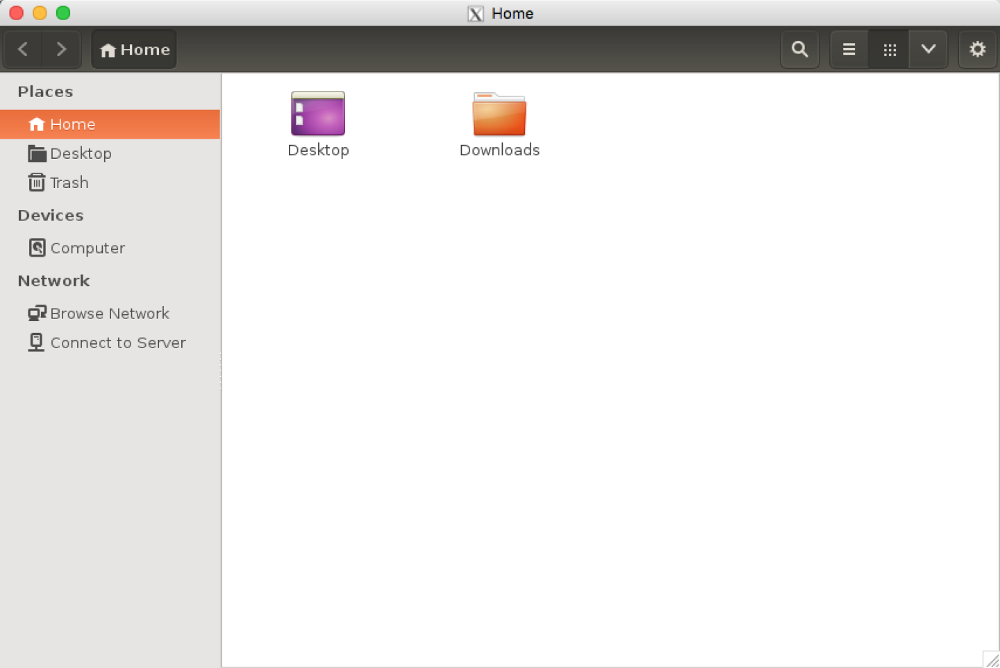

# ssh常用操作

## 基础

在 Linux 系统上 SSH 是非常常用的工具，通过 SSH Client 我们可以连接到运行了 SSH Server 的远程机器上。SSH Client 的基本使用方法是：

```bash
ssh user@remote -p port
```

- user 是你在远程机器上的用户名，如果不指定的话默认为当前用户
- remote 是远程机器的地址，可以是 IP，域名，或者是后面会提到的别名
- port 是 SSH Server 监听的端口，如果不指定的话就为默认值 22

实际上，知道了上面这三个参数，用任意的 SSH Client 都能连接上 SSH Server，例如在 Windows 上 [PuTTY](https://link.zhihu.com/?target=http%3A//www.chiark.greenend.org.uk/~sgtatham/putty/download.html) 就是很常用的 SSH Client。

```bash
local$ ssh user@remote -p port                                                      
user@remote's password: # 输入密码
```

在执行了 ssh 命令之后，远程机器会询问你的密码。在输入密码的时候，屏幕上不会显示明文密码，也不会显示 ******，这样别人就不会看到你的密码长度了，按下回车即可登入。

登入之后，你就可以操作远程机器啦！

## 安装 OpenSSH Server

```bash
local$ ssh user@remote -p port 
ssh: connect to host remote port 22: Connection refused
```

如果你遇到了上面的消息，说明在远程机器上没有安装 SSH Server，特别地，如果远程机器运行的是 Ubuntu Desktop 系统，那么默认是没有安装 SSH Server 的。这个时候，你可以联系管理员让他安装 SSH Server，或者如果你有 sudo 权限的话，可以执行下面命令安装：

```bash
sudo apt-get install openssh-server
```

## 免密码登入

每次 ssh 都要输入密码是不是很烦呢？与密码验证相对的，是公钥验证。也就是说，要实现免密码登入，首先要设置 SSH 钥匙。

执行 ssh-keygen 即可生成 SSH 钥匙，一路回车即可。Windows 用户可以使用 [PuTTY](https://link.zhihu.com/?target=http%3A//www.chiark.greenend.org.uk/~sgtatham/putty/download.html) 配套的 *PuTTYgen* 工具。

```bash
local$ ssh-keygen
Generating public/private rsa key pair.
Enter file in which to save the key (/home/user/.ssh/id_rsa):
Created directory '/home/user/.ssh'.
Enter passphrase (empty for no passphrase):
Enter same passphrase again:
Your identification has been saved in /home/user/.ssh/id_rsa.
Your public key has been saved in /home/user/.ssh/id_rsa.pub.
The key fingerprint is:
SHA256:47VkvSjlFhKRgz/6RYdXM2EULtk9TQ65PDWJjYC5Jys user@local
The key's randomart image is:
+---[RSA 2048]----+
|       ...o...X+o|
|      . o+   B=Oo|
|       .....ooo*=|
|        o+ooo.+ .|
|       .SoXo.  . |
|      .E X.+ .   |
|       .+.= .    |
|        .o       |
|                 |
+----[SHA256]-----+
```

这段话告诉了我们，生成的公钥放在了 ~/.ssh/id_rsa.pub，私钥放在了 ~/.ssh/id_rsa。接下来，我们要让远程机器记住我们的**公钥**。最简单的方法是 ssh-copy-id user@remote -p port

```bash
local$ ssh-copy-id user@remote -p port
/usr/bin/ssh-copy-id: INFO: Source of key(s) to be installed: "/home/user/.ssh/id_rsa.pub"
/usr/bin/ssh-copy-id: INFO: attempting to log in with the new key(s), to filter out any that are already installed
/usr/bin/ssh-copy-id: INFO: 1 key(s) remain to be installed -- if you are prompted now it is to install the new keys
user@remote's password:

Number of key(s) added: 1

Now try logging into the machine, with:   "ssh 'user@remote' -p port"
and check to make sure that only the key(s) you wanted were added.
```

ssh-copy-id 在绝大多数发行版上都有预装，在 Mac 上也可以通过 brew install ssh-copy-id 一键安装。

在没有 ssh-copy-id 的情况下（比如在 Windows 上），也是可以轻松做到这件事的。用命令的话也是一句话搞定

```bash
ssh user@remote -p port 'mkdir -p .ssh && cat >> .ssh/authorized_keys' < ~/.ssh/id_rsa.pub
```

这句话的意思是，在远端执行新建 .ssh 文件夹，并把本地的 ~/.ssh/id_rsa.pub （也就是公钥）追加到远端的 .ssh/authorized_keys 中。当然，不使用这条命令的话，你也可以手动操作这个过程，即先复制公钥，再登入远程机器，粘贴到 .ssh/authorized_keys 当中。

在完成这一步之后，ssh 进入远程机器时就不用输入密码了。Windows 用户在 PuTTY 上面设置登入用户名和 PuTTYgen 生成的私钥之后也可以免密码登入。

## 配置别名

每次都输入 ssh user@remote -p port，时间久了也会觉得很麻烦，特别是当 user, remote 和 port 都得输入，而且还不好记忆的时候。配置别名可以让我们进一步偷懒。

比如我想用 ssh lab 来替代上面这么一长串，那么在 ~/.ssh/config 里面追加以下内容：

```bash
Host lab #自定义名称
    HostName remote #IP
    User user #用户
    Port port #端口默认22
```

保存之后，即可用 ssh lab 登入，如果还配置了公钥登入，那就连密码都不用输入了。

Windows 用户使用 PuTTY 直接保存配置即可。

## 传输文件

在两台机之间传输文件可以用 scp，它的地址格式与 ssh 基本相同，都是可以省略用户名和端口，稍微的差别在与指定端口时用的是大写的 -P 而不是小写的。不过，如果你已经配置了别名，那么这都不重要，因为 scp 也支持直接用别名。scp 用起来很简单，看看下面的例子就明白了：

```bash
# 把本地的 /path/to/local/file 文件传输到远程的 /path/to/remote/file
scp -P port /path/to/local/file user@remote:/path/to/remote/file

# 也可以使用别名
scp /path/to/local/file lab:/path/to/remote/file

# 把远程的 /path/to/remote/file 下载到本地的 /path/to/local/file
scp lab:/path/to/remote/file /path/to/local/file

# 远程的默认路径是家目录
# 下面命令把当前目录下的 file 传到远程的 ~/dir/file
scp file lab:dir/file

# 加上 -r 命令可以传送文件夹
# 下面命令可以把当前目录下的 dir 文件夹传到远程的家目录下
scp -r dir lab:

# 别忘了 . 可以用来指代当前目录
# 下面命令可以把远程的 ~/dir 目录下载到当前目录里面
scp -r lab:dir/ .
```

Windows 用户可以使用 [PuTTY](https://link.zhihu.com/?target=http%3A//www.chiark.greenend.org.uk/~sgtatham/putty/download.html) 配套的 *PSCP*。

如果觉得使用命令行传输文件浑身不自在，你还可以使用 SFTP 协议。任何支持 SFTP 协议的客户端都能用你的 SSH 账号信息登入并管理文件，比如开源的有图形化界面的FTP客户端 [FileZilla](https://link.zhihu.com/?target=https%3A//filezilla-project.org/download.php%3Ftype%3Dclient)。别忘了，在这些客户端里面，你也可以指定你的私钥（~/.ssh/id_rsa），然后就能做到无密码登入了。

## 保持程序在后台运行

有时候你想要在远程的机器上跑一个需要长时间运行的程序，比如一些计算，然后当你睡了一觉再登入远程的机子上却发现什么结果都没有。这是因为一旦 ssh 进程退出，所有它之前启动的程序都会被杀死。那么有什么办法可以保持程序在后台运行呢？

你需要在远程的机子上使用 tmux。tmux 是一个会话管理程序，他会保持程序一直运行着。在 Ubuntu 上你可以通过 sudo apt-get install tmux 来安装。

```bash
remote$ tmux
```

这样你就进入到了 tmux 管理的会话中，之后你再运行任何东西都不会因为你退出 ssh 而被杀死。要暂时离开这个会话，可以先按下 ctrl+b 再按下 d。要恢复之前的会话，只需要执行

```bash
remote$ tmux attach
```

tmux 还能管理多个窗口、水平竖直切分、复制粘贴等等，你可以看看[这篇不错的文章](https://link.zhihu.com/?target=http%3A//blog.jobbole.com/87584/)来入门。

如果你是Mac用户，那么十分幸运的是，你几乎不需要任何学习，只要把你的终端由系统自带的 Terminal 换成 [iTerm 2](https://link.zhihu.com/?target=https%3A//www.iterm2.com/)。*iTerm 2* 自带超好的 tmux 支持，你可以像操作本机的标签页一样操作 tmux 会话。你只需要在新建会话的时候使用 tmux -CC，在恢复的时候使用 tmux -CC attach 即可。具体的可以参见 [iTerm2 and tmux Integration](https://link.zhihu.com/?target=https%3A//gitlab.com/gnachman/iterm2/wikis/TmuxIntegration)。

最后强调一遍，tmux 应该运行在**远程**的机子上，而不是本机上，否则程序在 ssh 退出时依然会被杀死。

## 反向端口转发：例子1

相信很多人都会有这样的需求：我实验室的机器和宿舍的机器都处在局域网中，但我需要在宿舍访问实验室的机器，或者反过来。这个时候，你需要一台处在公网的机器，如果没有的话，可以考虑[腾讯云](https://link.zhihu.com/?target=https%3A//www.qcloud.com/act/campus)或者[阿里云](https://link.zhihu.com/?target=https%3A//www.aliyun.com/act/aliyun/campus.html)的学生优惠。

假设现在你有一台处在公网的机器 jumpbox，这台机器是在任何地方都能访问到的；你在实验室也有一台机子 lab，这台机子只能在实验室内部访问，但他可以访问公网，你希望能在任何地方都能访问这台机器。使用 ssh -R 可以轻松地做到这个事情。

```bash
lab$ ssh -R 10022:localhost:22 jumpbox
jumpbox$ ssh user@localhost -p 10022
lab$
```

如果上面这个过程成功了，就说明在你执行 ssh -R 10022:localhost:22 jumpbox 之后，你成功地将 lab 上的 22 端口反向转发到了 jumpbox 的 10022 端口。只要保持这个 ssh 不断，任何一台机器都可以首先连接到 jumpbox，然后通过 ssh user@localhost -p 10022 连回到 lab。可以看到，这里 jumpbox 起到了一个跳板的作用，所以我们把它称作*跳板机*。

不过上面这么做并不稳健，如果因为网络波动导致 ssh -R 那个连接断了，那么从 jumpbox 就完全失去了到 lab 的控制。万幸的是，有一个叫做 autossh 的软件，可以自动的检测断线，并在断线的时候重连。在 Ubuntu 上你可以使用 sudo apt-get install autossh 来安装，在 Mac 上则是 brew install autossh。

```bash
lab$ autossh -NfR 10022:localhost:22 jumpbox
```

上面这句话里面 -N 表示非不执行命令，只做端口转发；-f 表示在后台运行，也就是说，这句话执行之后 autossh 就在后台默默工作啦；-R 10022:localhost:22 就是把本地的22端口转发到远程的10022端口。

现在，任何一台电脑先连上跳板机，就可以连回内网的机子啦！

你甚至可以将这句话设置为开机时运行：在 /etc/rc.local 里面 exit 0 这句话之前加上

```bash
su - user -c autossh -NfR 10022:localhost:22 jumpbox
```

其中 user 是你的用户名。需要注意的是，如果你需要开机时运行 autossh，你需要配置公钥登入，因为开机运行的时候是没有交互界面让你来输入密码的。

这里顺带说一句，你可以绑定1024到65535之间的任意端口，只要这个端口之前没有程序在用就行。

## 反向端口转发：例子2

还是反向端口转发，再举一个很常见的例子：我在本地跑了一个网站，我想临时把我的网站发给朋友看看。你可以很容易的复现这个实验：在本地运行 python -m SimpleHTTPServer 即可在本地的8000端口启动一个网站，你可以在浏览器中通过 [http://localhost:8000/](https://link.zhihu.com/?target=http%3A//localhost%3A8000/) 看到。下面我们想让远方的朋友看到这个网站。

```bash
local$ ssh -NR 0.0.0.0:18000:localhost:8000 jumpbox
```

远方的朋友即可通过 [http://jumpbox:18000/](https://link.zhihu.com/?target=http%3A//jumpbox%3A18000/) 看到了。注意到这里和上面的命令有一个小小的不同，就是多了 0.0.0.0，这告诉 ssh，要把18000端口绑定在远端的所有IP上。如果像之前那样省略的话，缺省值是只绑定在 localhost，也就是只有在 jumpbox 本机才可以访问，而其他人都不能访问。

## 反向端口转发：例子3

比方说在本地的127.0.0.1:1080运行了HTTP代理服务，现在我想让另一台机子 remote 也能够使用这个HTTP代理。

```bash
local$ ssh -NR 11080:localhost:1080 remote
local$ ssh remote
remote$ export http_proxy=http://127.0.0.1:11080/
remote$ export https_proxy=http://127.0.0.1:11080/
remote$ curl http://ifconfig.co
```

看看返回的IP，是不是 remote 也用上了代理？

## 正向端口转发

反向端口转发是把本机的端口转发到远程的机子上；与之对应，正向端口转发则是把远程的端口转发到本地。

比方说，之前我们把 lab 的22端口反向转发到了 jumpbox 的10022端口，现在我想把它转发到本机的20022端口，只需要执行 ssh -L 就行了，例如：

```bash
local$ ssh -NL 20022:localhost:10022 jumpbox
local$ ssh localhost -p 20022
lab$
```

## 用作 SOCKS5 代理

要是想要在家访问公司内网的一些网站，但是公司又没有提供进入内网的VPN，那怎么办呢？通过 ssh -D 可以在本地建立起一个 SOCKS5 代理：

```bash
local$ ssh -ND 1080 workplace
```

如果 workplace 处在内网，不要忘记前面讲到可以用反向端口转发和跳板机来解决这个问题。现在，你可以在浏览器的设置里面，把代理服务器设成 socks5://127.0.0.1:1080，然后你就可以看到 workplace 能看到的所有网站啦。

## 传递图形界面

上面我们都是在运行命令行程序，那如果远程有一些程序是不得不用图形界面的话，是不是无解了呢？实际上，恰恰相反，X11的设计天生就支持这样的行为。

首先，我们需要在本机装上 X Server：Linux 桌面用户本身就已经有了 X Server，Windows 用户可以使用 [Xming](https://link.zhihu.com/?target=http%3A//www.straightrunning.com/XmingNotes/)，Mac 用户需要使用 [XQuartz](https://link.zhihu.com/?target=https%3A//www.xquartz.org/)。

安装好了 X Server 之后，我们通过 ssh -X 进行连接，例如：

```bash
local$ ssh -X remote
remote$ xeyes
```

现在你应该会看到一对傻傻的眼睛，这就说明成功了，注意，这个眼睛是跑在远程的，而输入和输出都是在本地。这个方法几乎可以运行任何图形界面的程序，比如你可以试试看运行 nautilus 或者 firefox。

