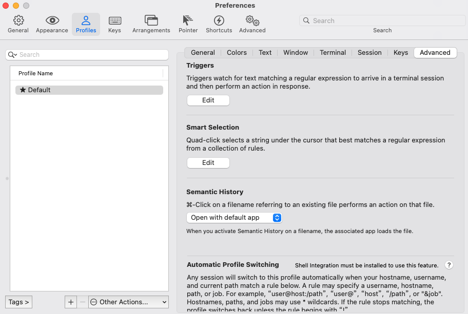
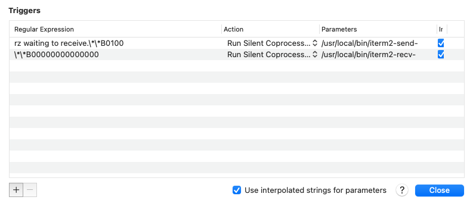

# Mac配置ITerm2

## install shell integration

```bash
安装完成之后会有一个指示标，需要弄掉

Preferences > Profiles > (your profile) > Terminal, scroll down to "Shell Integration", and turn off "Show mark indicators".
```

## 配置rz、sz

```bash
brew install lrzsz
```

[下载](https://github.com/xmvper/iterm2-zmodem)

iterm2-send-zmodem.sh
iterm2-recv-zmodem.sh

```bash
mv iterm2-send-zmodem.sh /usr/local/bin/
mv iterm2-recv-zmodem.sh /usr/local/bin/
chmod +x iterm2-*
```

打开iterm2 按住command + ，进入 Preperences->Profiles–>Advanced找到Triggers点击edit





```
Regular expression: rz waiting to receive.\*\*B0100
Action: Run Silent Coprocess
Parameters: /usr/local/bin/iterm2-send-zmodem.sh
Instant: checked

Regular expression: \*\*B00000000000000
Action: Run Silent Coprocess
Parameters: /usr/local/bin/iterm2-recv-zmodem.sh
Instant: checked
```

如果使用 brew 下载脚本

```
brew install laggardkernel/tap/iterm2-zmodem
但是如果用上面这种方式安装的，前面配置的sh脚本的名称有变化，自己最好去/usr/local/bin下面确认一下，需要修改成
/usr/local/bin/iterm2-zmodem-send
/usr/local/bin/iterm2-zmodem-recv
```


## 配置zsh

### 安装 Oh My Zsh

安装脚本来自于[Oh My Zsh官方仓库](https://links.jianshu.com/go?to=https%3A%2F%2Fgithub.com%2Fohmyzsh%2Fohmyzsh)

```bash
sh -c "$(curl -fsSL https://raw.githubusercontent.com/ohmyzsh/ohmyzsh/master/tools/install.sh)"
```

### 修改皮肤文件(个人喜好，各位随意)

```bash
vim ~/.oh-my-zsh/themes/fishy.zsh-theme
```

### 加载皮肤

```bash
sed -i '' 's/^\(ZSH_THEME=\)".*"$/\1"fishy"/g' ~/.zshrc
source ~/.zshrc
```

### 添加插件

### [zsh-syntax-highlighting](https://links.jianshu.com/go?to=https%3A%2F%2Fgithub.com%2Fzsh-users%2Fzsh-syntax-highlighting)

```bash
# mac os
brew install zsh-syntax-highlighting
echo 'source /usr/local/share/zsh-syntax-highlighting/zsh-syntax-highlighting.zsh'  >> ~/.zshrc
source ~/.zshrc
```

### [zsh-autosuggestions](https://links.jianshu.com/go?to=https%3A%2F%2Fgithub.com%2Fzsh-users%2Fzsh-autosuggestions)

```bash
#mac os
brew install zsh-autosuggestions
echo 'source /usr/local/share/zsh-autosuggestions/zsh-autosuggestions.zsh' >> ~/.zshrc
source ~/.zshrc
```