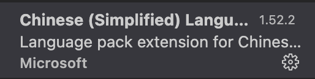
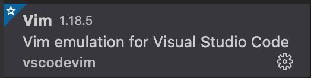
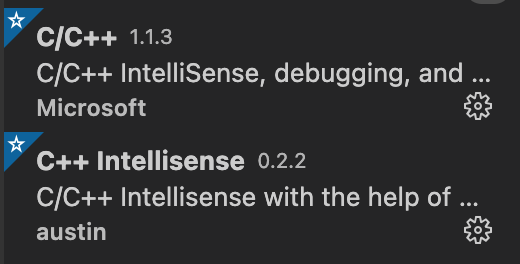
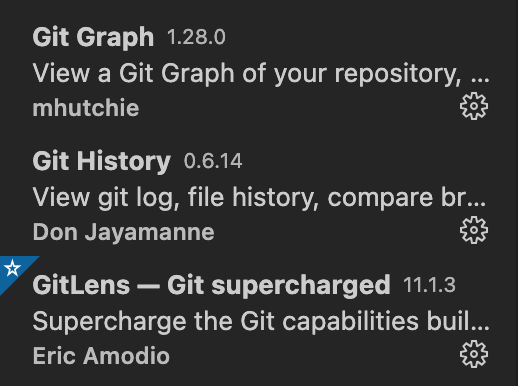
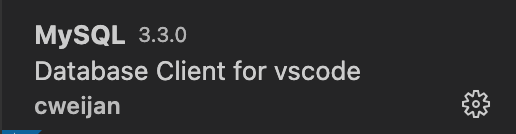
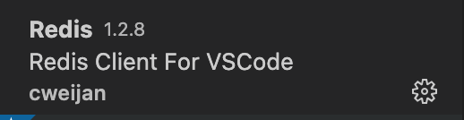
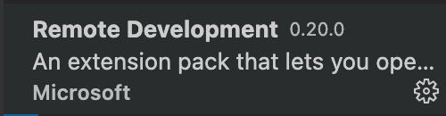

# Mac配置VScode

## 配置中文



## 配置vim编辑




## 配置python


## 配置C++



## 配置git



## 配置goland


```bash
#brew安装go
brew install go
#go安装目录
#brew安装之后会是这个路径GOROOT="/usr/local/Cellar/go/1.15.6/libexec"
export GOROOT=/usr/local/go 

#go工作目录,作为编译后二进制的存放目的地和import包时的搜索路径。其实说通俗点就是你的go项目工作目录。
#brew安装成功后会是这个路径GOPATH="/Users/zhengdongqi/go"
export GOPATH=/Users/zhengdongqi/gocode
#将go可执行文件加入PATH中，使GO命令与我们编写的GO应用可以全局调用
export PATH=$PATH:$GOROOT/bin:$GOPATH/bin
#使用go env可以查看当前环境

go get -u -v github.com/nsf/gocode 
go get -u -v github.com/rogpeppe/godef 
go get -u -v github.com/golang/lint/golint 
go get -u -v github.com/lukehoban/go-outline 
go get -u -v sourcegraph.com/sqs/goreturns 
go get -u -v golang.org/x/tools/cmd/gorename 
go get -u -v github.com/tpng/gopkgs 
go get -u -v github.com/newhook/go-symbols 
go get -u -v golang.org/x/tools/cmd/guru
```


## 配置mysql



## 配置redis



## 远程工具



## 配置web

[看另一个文档]: ../11.前端基础笔记/00.配置环境.md

