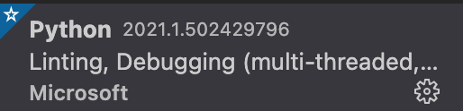
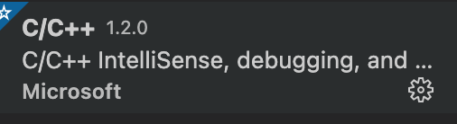

# Mac配置VScode

## 配置中文


## 配置vim编辑


## 配置python



## 配置C++



## 配置git


## 配置goland


```bash
go get -u -v github.com/nsf/gocode 
go get -u -v github.com/rogpeppe/godef 
go get -u -v github.com/golang/lint/golint 
go get -u -v github.com/lukehoban/go-outline 
go get -u -v sourcegraph.com/sqs/goreturns 
go get -u -v golang.org/x/tools/cmd/gorename 
go get -u -v github.com/tpng/gopkgs 
go get -u -v github.com/newhook/go-symbols 
go get -u -v golang.org/x/tools/cmd/guru
```


## 配置mysql


## 配置redis


## 远程工具


## 配置web

[看另一个文档]: ../11.前端基础笔记/00.配置环境.md

