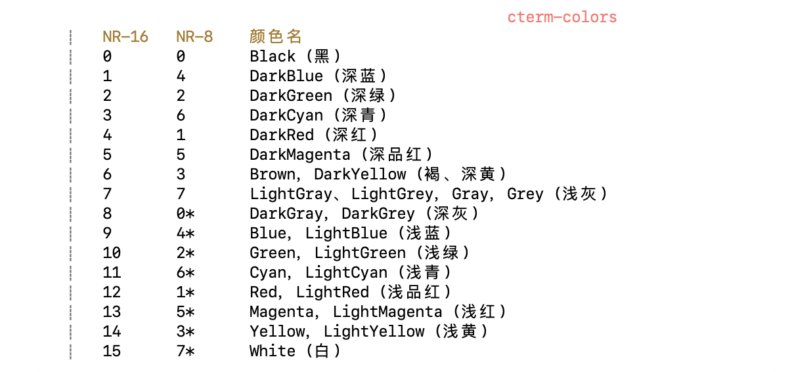
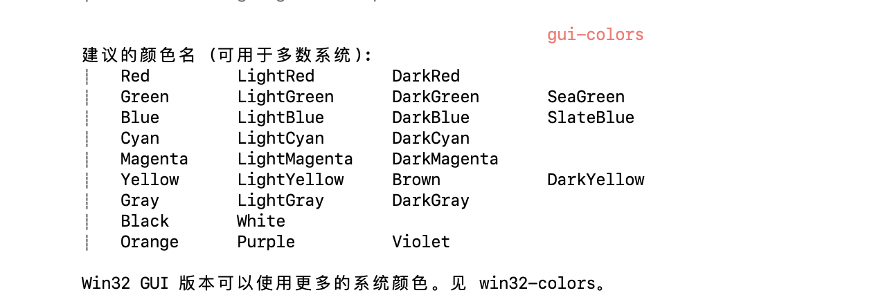

# Mac配置vim颜色





## 参考版

```bash
SpecialKey   xxx term=bold ctermfg=81 guifg=Cyan
EndOfBuffer  xxx links to NonText
NonText    xxx term=bold ctermfg=12 gui=bold guifg=Blue
Directory   xxx term=bold ctermfg=10
ErrorMsg    xxx term=standout ctermfg=9
IncSearch   xxx term=reverse ctermfg=11 ctermbg=0
Search     xxx term=reverse ctermfg=0 ctermbg=11 guifg=Black guibg=Yellow
MoreMsg    xxx term=bold ctermfg=121 gui=bold guifg=SeaGreen
ModeMsg    xxx term=bold cterm=bold gui=bold
LineNr     xxx term=underline ctermfg=11 guifg=Yellow
LineNrAbove  xxx cleared
LineNrBelow  xxx cleared
CursorLineNr  xxx term=bold cterm=underline ctermfg=11 gui=bold guifg=Yellow
Question    xxx term=standout ctermfg=121 gui=bold guifg=Green
StatusLine   xxx term=bold,reverse cterm=bold,reverse gui=bold,reverse
StatusLineNC  xxx term=reverse cterm=reverse gui=reverse
VertSplit   xxx term=reverse cterm=reverse gui=reverse
Title     xxx term=bold ctermfg=225 gui=bold guifg=Magenta
Visual     xxx term=reverse ctermbg=242 guibg=DarkGrey
VisualNOS   xxx term=bold,underline cterm=bold,underline gui=bold,underline
WarningMsg   xxx term=standout ctermfg=224 guifg=Red
WildMenu    xxx term=standout ctermfg=0 ctermbg=11 guifg=Black guibg=Yellow
Folded     xxx term=standout ctermfg=10
FoldColumn   xxx term=standout ctermfg=10
DiffAdd    xxx term=bold ctermbg=4 guibg=DarkBlue
DiffChange   xxx term=bold ctermbg=5 guibg=DarkMagenta
DiffDelete   xxx term=bold ctermfg=12 ctermbg=6 gui=bold guifg=Blue guibg=DarkCyan
DiffText    xxx term=reverse cterm=bold ctermbg=9 gui=bold guibg=Red
SignColumn   xxx term=standout ctermfg=14 ctermbg=242 guifg=Cyan guibg=Grey
Conceal    xxx ctermfg=7 ctermbg=242 guifg=LightGrey guibg=DarkGrey
SpellBad    xxx term=reverse ctermbg=9 gui=undercurl guisp=Red
SpellCap    xxx term=reverse ctermbg=12 gui=undercurl guisp=Blue
SpellRare   xxx term=reverse ctermbg=13 gui=undercurl guisp=Magenta
SpellLocal   xxx term=underline ctermbg=14 gui=undercurl guisp=Cyan
Pmenu     xxx ctermfg=0 ctermbg=13 guibg=Magenta
PmenuSel    xxx ctermfg=242 ctermbg=0 guibg=DarkGrey
PmenuSbar   xxx ctermbg=248 guibg=Grey
PmenuThumb   xxx ctermbg=15 guibg=White
TabLine    xxx term=underline cterm=underline ctermfg=15 ctermbg=242 gui=underline guibg=DarkGrey
TabLineSel   xxx term=bold cterm=bold gui=bold
TabLineFill  xxx term=reverse cterm=reverse gui=reverse
CursorColumn  xxx term=reverse
CursorLine   xxx term=underline cterm=underline
ColorColumn  xxx term=reverse ctermfg=9 ctermbg=9
QuickFixLine  xxx links to Search
StatusLineTerm xxx term=bold,reverse cterm=bold ctermfg=0 ctermbg=121 gui=bold guifg=bg guibg=LightGreen
StatusLineTermNC xxx term=reverse ctermfg=0 ctermbg=121 guifg=bg guibg=LightGreen
Normal     xxx guifg=#f0f0f0 guibg=#252c31
MatchParen   xxx term=reverse ctermbg=6 guibg=DarkCyan
ToolbarLine  xxx term=underline ctermbg=242 guibg=Grey50
ToolbarButton xxx cterm=bold ctermfg=0 ctermbg=7 gui=bold guifg=Black guibg=LightGrey
Comment    xxx term=bold ctermfg=240 gui=italic
Constant    xxx term=underline cterm=bold ctermfg=5
Special    xxx term=bold ctermfg=224 guifg=Orange
Identifier   xxx term=underline cterm=bold ctermfg=14 guifg=#40ffff
Statement   xxx term=bold ctermfg=11 gui=bold guifg=#ffff60
PreProc    xxx term=underline ctermfg=81 guifg=#ff80ff
Type      xxx term=underline ctermfg=121 gui=bold guifg=#60ff60
Underlined   xxx term=underline cterm=underline ctermfg=81 gui=underline guifg=#80a0ff
Ignore     xxx ctermfg=0 guifg=bg
Error     xxx term=reverse ctermfg=9
Todo      xxx term=standout ctermfg=0 ctermbg=11 guifg=Blue guibg=Yellow
String     xxx links to Constant
Character   xxx ctermfg=12
Number     xxx links to Constant
Boolean    xxx ctermfg=5
Float     xxx ctermfg=12
Function    xxx ctermfg=45
Conditional  xxx cterm=bold ctermfg=5
Repeat     xxx links to Statement
Label     xxx links to Statement
Operator    xxx links to Statement
Keyword    xxx links to Statement
Exception   xxx cterm=bold ctermfg=5
Include    xxx ctermfg=94
Define     xxx ctermfg=94
Macro     xxx links to PreProc
PreCondit   xxx links to PreProc
StorageClass  xxx links to Type
Structure   xxx links to Type
Typedef    xxx links to Type
Tag      xxx links to Special
SpecialChar  xxx links to Special
Delimiter   xxx ctermfg=0
SpecialComment xxx links to Special
Debug     xxx ctermfg=11 ctermbg=9
Cursor     xxx cterm=reverse ctermfg=14 ctermbg=14
```

## 自定义xcodelight版

```bash
" Vim color file
" create by NickDeCodes (NickDeCodes@163.com)

set background=dark
set t_Co=256
hi clear

if exists("syntax_on")
  syntax reset
endif

let colors_name = "xcodelight"
" 初始化
hi Normal         ctermfg=NONE ctermbg=NONE cterm=NONE guifg=#f0f0f0 guibg=#252c31 gui=NONE " 普通文本 
hi Boolean        ctermfg=darkmagenta ctermbg=NONE cterm=NONE guifg=NONE guibg=NONE gui=NONE " bool值高亮
hi Cursor         ctermfg=Cyan ctermbg=Cyan cterm=inverse guifg=NONE guibg=NONE gui=NONE " 光标所在的字符
hi CursorLine     ctermfg=NONE ctermbg=NONE cterm=underline guifg=NONE guibg=NONE gui=NONE " 光标当前行
hi CursorLineNr   ctermfg=Black ctermbg=NONE cterm=underline guifg=NONE guibg=NONE gui=NONE " 光标当前行
hi CursorColumn   ctermfg=NONE ctermbg=NONE cterm=NONE guifg=NONE guibg=NONE gui=NONE " 光标当前列
hi ColorColumn    ctermfg=Red ctermbg=Red cterm=NONE guifg=NONE guibg=NONE gui=NONE " 颜色列
hi Character      ctermfg=12 ctermbg=NONE cterm=NONE guifg=NONE guibg=NONE gui=NONE " 字符高亮
hi Comment        ctermfg=240 ctermbg=NONE cterm=NONE guifg=NONE guibg=NONE gui=italic " 文件头部声明
hi Constant       ctermfg=darkmagenta ctermbg=NONE cterm=bold guifg=NONE guibg=NONE gui=NONE " 任何常数
hi Conditional    ctermfg=darkmagenta ctermbg=NONE cterm=bold guifg=NONE guibg=NONE gui=NONE " if、then、else、endif、switch 等
hi Debug          ctermfg=Yellow ctermbg=Red cterm=NONE guifg=NONE guibg=NONE gui=NONE " 调试语句
hi Define         ctermfg=94 ctermbg=NONE cterm=NONE guifg=NONE guibg=NONE gui=NONE " 预处理命令 #define
hi Directory      ctermfg=10 ctermbg=NONE cterm=NONE guifg=NONE guibg=NONE gui=NONE " 目录名 (还有列表里的其它特殊名字)
hi Delimiter      ctermfg=Black ctermbg=NONE cterm=NONE guifg=NONE guibg=NONE gui=NONE " 需要注意的字 分隔符<>
hi DiffAdd        ctermfg=Grey ctermbg=Red cterm=NONE guifg=NONE guibg=NONE gui=bold " diff 模式: 增加的行 |diff.txt|
hi DiffDelete     ctermfg=Red ctermbg=Cyan cterm=NONE guifg=NONE guibg=NONE gui=NONE " diff 模式: 删除的行 |diff.txt|
hi DiffChange     ctermfg=Cyan ctermbg=Cyan cterm=NONE guifg=NONE guibg=NONE gui=NONE " diff 模式: 改变的行 |diff.txt|
hi DiffText       ctermfg=Yellow ctermbg=Cyan cterm=NONE guifg=NONE guibg=NONE gui=bold " diff 模式: 改变行里的改动文本 |diff.txt|
hi Error          ctermfg=Red ctermbg=NONE cterm=NONE guifg=NONE guibg=NONE gui=NONE " 错误左侧>>
hi ErrorMsg       ctermfg=Red ctermbg=NONE cterm=NONE guifg=NONE guibg=NONE gui=NONE " 命令行中的错误提示
hi Exception      ctermfg=darkmagenta ctermbg=NONE cterm=bold guifg=NONE guibg=NONE gui=NONE " try、catch、throw
hi EndOfBuffer    ctermfg=240 ctermbg=NONE cterm=NONE guifg=NONE guibg=NONE gui=NONE
hi Folded         ctermfg=10 ctermbg=NONE cterm=NONE guifg=NONE guibg=NONE gui=NONE " 折叠行高亮 
hi FoldColumn 	  ctermfg=10 ctermbg=NONE cterm=NONE guifg=NONE guibg=NONE gui=NONE " 用于关闭的折叠的列
hi Float          ctermfg=12 ctermbg=NONE cterm=NONE guifg=NONE guibg=NONE gui=NONE " float值高亮
hi Function       ctermfg=45 ctermbg=NONE cterm=NONE guifg=NONE guibg=NONE gui=NONE " 函数名 (也包括: 类的方法名)
hi Include        ctermfg=94 ctermbg=NONE cterm=NONE guifg=NONE guibg=NONE gui=NONE " 预处理命令 #include
hi IncSearch      ctermfg=Yellow ctermbg=Black cterm=NONE guifg=NONE guibg=NONE gui=NONE " 高亮；也用于被 ":s///c" 替换的文本
hi Identifier     ctermfg=NONE ctermbg=NONE cterm=NONE guifg=NONE guibg=NONE gui=NONE " 任何变量名
hi Keyword        ctermfg=darkmagenta ctermbg=NONE cterm=bold guifg=NONE guibg=NONE gui=NONE " 其它关键字
hi LineNr         ctermfg=240 ctermbg=NONE cterm=NONE guifg=NONE guibg=NONE gui=NONE " 左侧行号
hi Label          ctermfg=darkmagenta ctermbg=NONE cterm=bold guifg=NONE guibg=NONE gui=NONE " case、default 等
hi Menu           ctermfg=Cyan ctermbg=Grey cterm=NONE guifg=NONE guibg=NONE gui=NONE " 当前菜单的字体、背景色和前景色。也包括工具栏。可用的高亮参数: font、guibg、guifg。
hi Macro          ctermfg=94 ctermbg=NONE cterm=NONE guifg=NONE guibg=NONE gui=NONE " 宏
hi MatchParen     ctermfg=Yellow ctermbg=Black cterm=inverse guifg=NONE guibg=NONE gui=underline " 括号匹配
hi ModeMsg 		    ctermfg=Black ctermbg=NONE cterm=NONE guifg=NONE guibg=NONE gui=NONE " 模式高亮
hi MoreMsg 		    ctermfg=NONE ctermbg=NONE cterm=NONE guifg=NONE guibg=NONE gui=NONE " 输入栏提示
hi NonText        ctermfg=240 ctermbg=NONE cterm=NONE guifg=NONE guibg=NONE gui=NONE " 非文本区（控制字符和一些特殊字符和编辑器空白区等）
hi Number         ctermfg=12 ctermbg=NONE cterm=NONE guifg=NONE guibg=NONE gui=NONE " 数字
hi Operator       ctermfg=darkmagenta ctermbg=NONE cterm=bold guifg=NONE guibg=NONE gui=NONE " "sizeof"、"+"、"*" 等
hi Pmenu          ctermfg=240 ctermbg=NONE cterm=NONE guifg=NONE guibg=NONE gui=NONE "弹出菜单: 普通项目 补全提示行 
hi PmenuSel       ctermfg=27 ctermbg=Black cterm=inverse guifg=NONE guibg=NONE gui=NONE " 弹出菜单: 选中项目。 补全光标行
hi PmenuSbar      ctermfg=Red ctermbg=Green cterm=inverse guifg=NONE guibg=NONE gui=NONE " 弹出菜单: 滚动条
hi PmenuThumb     ctermfg=Cyan ctermbg=Green cterm=inverse guifg=NONE guibg=NONE gui=NONE " 弹出菜单: 滚动条的拇指 (thumb)
hi PreProc        ctermfg=94 ctermbg=NONE cterm=NONE guifg=NONE guibg=NONE gui=NONE " 通用预处理命令
hi PreCondit      ctermfg=94 ctermbg=NONE cterm=NONE guifg=NONE guibg=NONE gui=NONE " 预处理命令makefile ifneq
hi Question 		  ctermfg=Black ctermbg=NONE cterm=NONE guifg=NONE guibg=NONE gui=bold " |hit-enter| 提示和 yes/no 问补全时下方的提示信息1/5
hi Repeat         ctermfg=darkmagenta ctermbg=NONE cterm=bold guifg=NONE guibg=NONE gui=NONE " for、do、while 等
hi StatusLine     ctermfg=231 ctermbg=59 cterm=bold guifg=NONE guibg=NONE gui=bold " 当前窗口的状态行
hi StatusLineNC   ctermfg=231 ctermbg=59 cterm=bold guifg=NONE guibg=NONE gui=NONE " 非当前窗口的状态行
hi Search         ctermfg=Yellow ctermbg=Black cterm=reverse guifg=NONE guibg=NONE gui=underline " 查找高亮
hi Special        ctermfg=240 ctermbg=NONE cterm=NONE guifg=NONE guibg=NONE gui=NONE " python#注释
hi SpecialChar    ctermfg=203 ctermbg=NONE cterm=NONE guifg=NONE guibg=NONE gui=NONE " %s
hi SpecialKey     ctermfg=NONE ctermbg=NONE cterm=NONE guifg=NONE guibg=NONE gui=NONE " ^[]
hi Statement      ctermfg=darkmagenta ctermbg=NONE cterm=Bold guifg=NONE guibg=NONE gui=NONE " 任何语句
hi StorageClass   ctermfg=darkmagenta ctermbg=NONE cterm=Bold guifg=NONE guibg=NONE gui=NONE " static、register、volatile 等
hi SignColumn     ctermfg=NONE ctermbg=NONE cterm=NONE guifg=NONE guibg=NONE gui=NONE " 显示 |signs| 的列
hi Structure      ctermfg=darkmagenta ctermbg=NONE cterm=Bold guifg=NONE guibg=NONE gui=NONE " struct、union、enum等
hi String         ctermfg=203 ctermbg=NONE cterm=NONE guifg=NONE guibg=NONE gui=NONE " 字符串
hi SpellBad       term=reverse ctermbg=9 gui=undercurl guisp=Red " 拼写检查器不能识别的单词。|spell|它会和本来应该使用的高亮进行组合
hi SpellCap       term=reverse ctermbg=12 gui=undercurl guisp=Blue " 拼写检查器能识别但只在其它区域使用的单词
hi SpellRare      ctermfg=203 ctermbg=NONE cterm=NONE guifg=NONE guibg=NONE gui=NONE " 拼写检查器能识别但很少使用的单词
hi Scrollbar      ctermfg=Cyan ctermbg=Grey cterm=NONE guifg=NONE guibg=NONE gui=NONE " 主窗口滚动条的当前背景和前景色。可用的高亮参数: guibg、guifg。
hi SpecialComment ctermfg=Cyan ctermbg=Blue cterm=NONE guifg=NONE guibg=NONE gui=NONE " 注释里的特殊部分
hi Tag            ctermfg=Green ctermbg=Blue cterm=NONE guifg=NONE guibg=NONE gui=NONE " 可以使用 CTRL-] 的项目
hi Todo           ctermfg=203 ctermbg=NONE cterm=NONE guifg=NONE guibg=NONE gui=inverse,bold,italic " 需要特殊注意的部分；主要是关键字 TODO FIXME 和 XX
hi Type           ctermfg=darkmagenta ctermbg=NONE cterm=bold guifg=NONE guibg=NONE gui=NONE " int、void、bool、char等声明语法高亮
hi Title          ctermfg=NONE ctermbg=NONE cterm=NONE guifg=NONE guibg=NONE gui=bold " ":set all"、":autocmd" 等输出的标题 markdown标题
hi Tooltip	      ctermfg=Cyan ctermbg=Grey cterm=NONE guifg=NONE guibg=NONE gui=NONE " 当前工具提示的字体、背景色和前景色。也包括工具栏。可用的高亮参数: font、guibg、guifg。
hi Typedef        ctermfg=darkmagenta ctermbg=NONE cterm=bold guifg=NONE guibg=NONE gui=NONE " typedef 定义
hi TabLine        ctermfg=Cyan ctermbg=Grey cterm=NONE guifg=NONE guibg=NONE gui=NONE " 标签页行，非活动标签页标签
hi TabLineFill    ctermfg=Cyan ctermbg=Grey cterm=NONE guifg=NONE guibg=NONE gui=NONE " 标签页行，没有标签的地方
hi TabLineSel     ctermfg=Cyan ctermbg=Grey cterm=NONE guifg=NONE guibg=NONE gui=NONE " 标签页行，活动标签页标签
hi Underlined     ctermfg=Cyan ctermbg=Grey cterm=NONE guifg=NONE guibg=NONE gui=NONE " 需要突出的文本，HTML 链接
hi Visual         ctermfg=NONE ctermbg=Cyan cterm=NONE guifg=NONE guibg=NONE gui=NONE " 可视模式的选择区
hi VertSplit      ctermfg=NONE ctermbg=Grey cterm=NONE guifg=NONE guibg=NONE gui=NONE " 分离垂直分割窗口的列
hi VisualNOS      ctermfg=Yellow ctermbg=Grey cterm=NONE guifg=NONE guibg=NONE gui=NONE " Vim 是 "选择区的非拥有者" 时，可视模式的选择区
hi WildMenu 		  ctermfg=Blue ctermbg=Grey cterm=NONE guifg=NONE guibg=NONE gui=NONE " 'wildmenu' 补全的当前匹配
hi WarningMsg     ctermfg=Yellow ctermbg=NONE cterm=NONE guifg=NONE guibg=NONE gui=NONE " 命令行中的警告提示
```


## 自定义xcodedark版