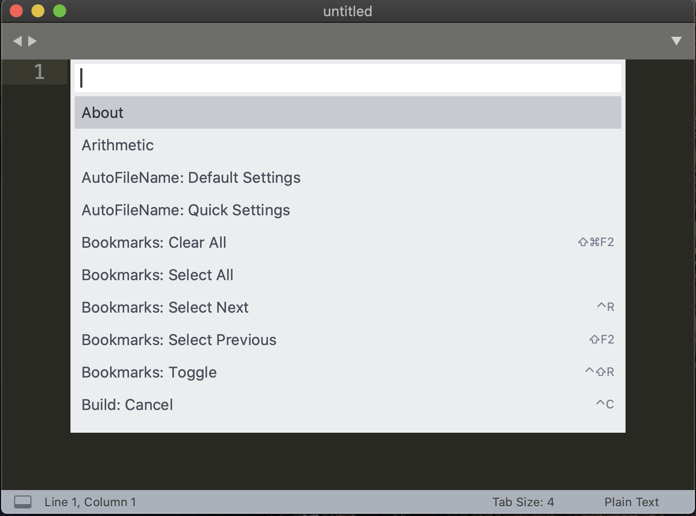
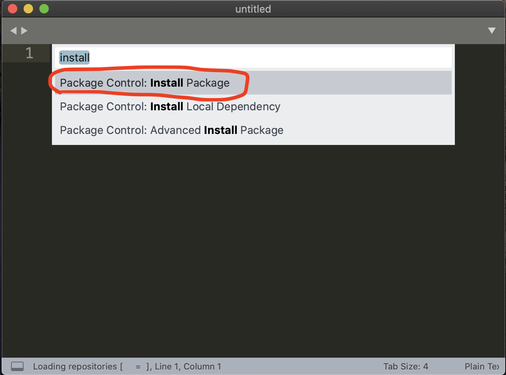
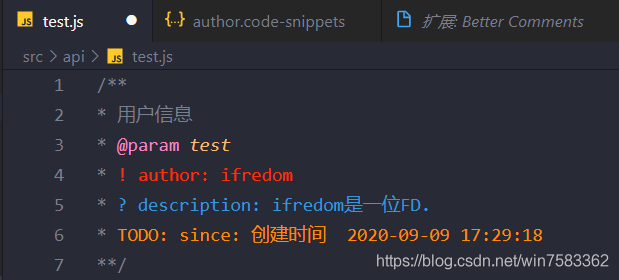

# Sublime配置

## 软件安装

- [点击官网下载](http://www.sublimetext.com/3)

## 插件安装

新版的sublime已经默认安装了package control，我们可以通过package control 安装适合自己的插件。如果没有安装package control，直接按command + shift + p 唤出命令列表，(windows用户把command键改为crtl键)输入install，点击install package control，耐心等待安装好package control会有弹框提示。

**以下三步为安装插件的方法：**

- 在sublime界面中，mac用户使用command + shift + p 唤出package control 命令列表，windows用户使用crtl + shift + p,为了方便本文中所有提到command键都是指windows中的crtl键。
- 
- 在输入框中输入install，点击列表中的第一项（Package control:install package）,点击后列表会消失然后等待片刻，等sublime去加载完列表，会又弹出列表。
- 
- 等插件列表加载出来后，输入想要安装的插件，会加载相应的插件，点击就会自动下载安装了，然后重复以上3步下载其它插件。
- 如果安装了一个插件，但是配置文件修改错了并且无法恢复，可以删除这个插件然后重新安装。删除的步骤：command + shift + p => 输入remove => 点击列表中要卸载的插件，稍等即可

## 常用插件和使用方法 

### 1. Emmet

在package control 中输入emmet，选中第一个Emmet,Emmet前身是大名鼎鼎的Zen Coding,主要使用到它的两大功能：

- 自定义代码片段

     在窗口顶栏中找到 perferences -> Package Settings -> Emmet -> setting-user
     在文件中可以配置自定义模板，比如：

```javascript
{
    "snippets": {
        "html": {
                "snippets": {
                "hkhtml": "<!DOCTYPE html>\n<html>\n\n<head>\n    <meta http-equiv=\"Content-Type\" content=\"text/html; charset=UTF-8\" />\n    <title>todo-title</title>\n    <!-- 使用chrome和最新版ie渲染 -->\n    <meta http-equiv=\"X-UA-Compatible\" content=\"IE=edge,chrome=1\" />\n    <!-- SEO页面关键词 -->\n    <meta name=\"keywords\" content=\"todo-content\" />\n    <!-- SEO页面描述 -->\n    <meta name=\"description\" content=\"todo-des\" />\n    <!-- 作者 -->\n    <meta name=\"author\" content=\"hekui\" />\n    <!-- 图标 -->\n    <link rel=\"shortcut icon\" type=\"image/ico\" href=\"/todo.ico\" />\n     <!-- 移动端 -->\n     <!--     <meta name=\"viewport\" content=\"width=device-width,initial-scale=1.0, minimum-scale=1.0, maximum-scale=1.0, user-scalable=no\" /> -->\n\n    <!-- 引入js-cdn,修改vue可引入其它库(cdn地址类式) -->\n    <script src=\"https://unpkg.com/vue\"></script>\n    <!-- 样式重置 -->\n    <link rel=\"stylesheet\" type=\"text/css\" href=\"https://cdn.bootcss.com/meyer-reset/2.0/reset.min.css\">\n</head>\n<body>\n</body>\n</html>"
                },
            "abbreviations": {
            }
        }
    }
}
```

以上配置了hkhtml这个代码块，只要在sublime中输入hkhtml然后按tab键，就会自动生成后面的代码，效果如下：

```html
<!DOCTYPE html>
<html>
<head>
    <meta http-equiv="Content-Type" content="text/html; charset=UTF-8" />
    <title>todo-title</title>
    <!-- 使用chrome和最新版ie渲染 -->
    <meta http-equiv="X-UA-Compatible" content="IE=edge,chrome=1" />
    <!-- SEO页面关键词 -->
    <meta name="keywords" content="todo-content" />
    <!-- SEO页面描述 -->
    <meta name="description" content="todo-des" />
    <!-- 作者 -->
    <meta name="author" content="" />
    <!-- 图标 -->
    <link rel="shortcut icon" type="image/ico" href="/todo.ico" />
     <!-- 移动端 -->
     <!--     <meta name="viewport" content="width=device-width,initial-scale=1.0, minimum-scale=1.0, maximum-scale=1.0, user-scalable=no" /> -->
    <!-- 引入js-cdn,修改vue可引入其它库(cdn地址类式) -->
    <script src="https://unpkg.com/vue"></script>
    <!-- 样式重置 -->
    <link rel="stylesheet" type="text/css" href="https://cdn.bootcss.com/meyer-reset/2.0/reset.min.css">
</head>
<body>
</body>
</html>
```

你可以把经常使用的代码设置成代码块，然后用快捷键来代替，这对于平时写个小demo或者写个练手项目还是很方便的。

除了可以自定义代码片段，emmet还自带了代码片段功能，Emmet提供了很多快捷生成代码的规则，个人觉得只需要记住最常用的几个就够了，例如：

div>(header>ul>li*2>a)+footer>p 会生成代码 =>>

```html
<div>
    <header>
        <ul>
            <li><a href=""></a></li>
            <li><a href=""></a></li>
        </ul>
    </header>
    <footer>
        <p></p>
    </footer>
</div>
```

上面例子中，> 表示父子关系，+ 表示兄弟关系 ，（）表示优先级，* 表示标签有几个

又比如：
div#header.wide>p.class1.class2 会生成代码 =>>

```html
    <div id = "header" class = "wide">
        <p class = "class1 class2"></p>
    </div>
```

上面例子中，在标签后面加上#表示id值，加上.表示class值，多个class和id可以混写在一起。

### 2. SideBarEnhancements

> SideBarEnhancements 插件大大增强了侧边栏的功能，比如可以移动文件、重命名文件、删除文件、备份文件、在磁盘中打开文件目录、双栏编辑文件、在浏览器中预览文件等，功能很简单只需要一个个尝试下就好了，是一个好用而简单的插件。
>
> 其中在浏览器中打开的功能，可以代替view in browser这个插件，你可以指定它打开网页的浏览器，这样就不会担心360浏览器等浏览器捣乱了。(就算默认浏览器是360，只要你在sublime中指定了浏览器，会用指定的浏览器打开)。

指定浏览器配置如下：

perferences -> Package Settings -> Side Bar -> setting-user

```javascript
{
    "default_browser": "chrome" //one of this list: firefox, aurora, chrome, canary, chromium, opera, safari
}
```

### 3. HTML-CSS-JS Prettify

> HTML-CSS-JS Prettify 是一款格式化代码的工具，安装好后，只需要command + shift + h 快捷键就可以格式化代码，或者 右键 -> HTML-CSS-JS Prettify -> prettify code 也可以格式化代码。
>
> prettify的安装需要依赖node.js，你需要安装node.js，如果还没有安装请戳 => [node.js官网](https://nodejs.org/en/)
>
> 如果你已经安装了node.js 但是还是提示缺失node.js，或者提示路径不对， 你需要在prettify中配置node.js的路径.
>
> perferences -> Package Settings -> HTML-CSS-JS Prettify -> set node path 把文件中的node.js路径设置成正确的就ok了，顺便提一句，只要把format_on_save 设置为 true，在每次保存文件的时候，它就会自动格式化代码了。

### 4. DocBlockr

> DocBlockr 可以跟js方法加上注释，虽然是不需要跟每个js方法加上注释的，但是在一些重要的、难懂的方法上加上注释是很必要的。
>
> 安装好DocBlockr 在js方法前输入/**然后按下tab键就会生成注释的格式，如果你需要在注释里加上作者和日期等信息，就需要去配置下。下面配置加上了作者和日期。
>
> perferences -> Package Settings -> DocBlockr -> setting-user

```javascript
 {
    "jsdocs_extra_tags": [
        "@Author hekui",
        "@DateTime {{date}}",
    ],
    "jsdocs_function_description": true
}
```

 

### 5. SublimeLinter

> SublimeLinter 是一个语法检查器插件，安装它以后就可以很容易就提示出一些低级错误
>
> 要想SublimeLinter 生效，你还得安装对应的语法检查器，SublimeLinter-csslint和SublimeLinter-jshint，安装方法和安装普通sublime插件一样，它们分别检查js代码和css代码
>
> 安装完这两个插件，还需要通过npm安装对应的eslint 和 csslint，最后才能生效。
>
> 在命令行输入npm install -g csslint 安装csslint，输入npm install -g jshint 安装jshint，到最后这个css和js语法检查插件就装好了。如果你需要配置sublimelinter只需要右键=>sublimelinter就可以设置了，当然如果你想通过配置文件更详细的配置也是可以的。

### 6. LiveReload

> 修改过代码后，网页会自动刷新，这是会让很多人都心动的功能，而LiveReload就实现了这个功能。
>
> 首先得安装LiveReload插件，正常通过package control安装就可以了，然后配置一下
>
> Preference>Package Settings>LiveReload>Settings User

```javascript
{
   "enabled_plugins": [
       "SimpleReloadPlugin",
       "SimpleRefresh"
   ]
}
```

最后在浏览器中安装LiveReload插件，我一般使用的是chrome，所以直接在chrome商店中直接下载安装就好了，安装好后在右上角插件列表中右键LiveReload点击管理扩展程序，进入liveReload设置界面，把允许访问文件网址勾选上就ok了。

然后在浏览器中打开需要实时刷新的网页，在右上角把liveReload这个插件点击一下，图标会变成实心的就ok了。

最后一步，是需要打开sublime中liveReload服务(前面步骤只是安装了，并没有打开服务)，command + shift + p => 输入liveReload然后选择LiveReload:Enable/disable plug-ins => 输入simple 选择 Enable - simple Reload，到这里网页实时刷新的功能就实现了。

以后需要自动刷新网页的时候，就只需要3部，首先在浏览器中打开网页然后在右上角点击liveReload插件打开浏览端liveReload功能，然后在sublime中打开liveReload服务(sublime在第一次打开的时候需要重新打开liveReload服务，如果没关闭过不需要重新打开liveReload服务)。

### 7. SublimeTmpl

> 通过SublimeTmpl可以新建一个文件的时候自定义模板，安装好后在file栏目中会有new file (SublimeTmpl)这一项，选择要新建的文件就可以新建自定义模板的文件。
>
> > 通过配置这个文件可以修改new file(sublimeTpl)的子目录列表:
> > Preference>Package Settings> SublimeTmpl>menu default
>
> 你写的模板文件需要存放在/Packages/SublimeTmpl/templates这个目录下，如果你配置的vue文件，文件名应该为vue.tmpl，文件内容就是新建vue文件的默认模板。

### 8. FileDiffs

> fileDiffs 提供了对比文件对比功能，通过package control安装后，通过diff with previous 和前一个文件对比，diff with clipboard 就是和剪切板代码对比，对比后会生成一个对比之后的文件，这在拷贝代码和学习代码的时候非常有用。

### 9. AutoFileName

> AutoFileName 提供了文件路径提示功能，比如你要选择images文件夹下的一个图片，输入images/后会提示出图片列表给你选择，安装方法还是通过package control安装。在输入文件路径的时候会自动提示。

### 10. ColorPicker

> ColorPicker提供了颜色面板选择的功能，写个demo啥的还是很方便的，通过package control 安装即可。commond + shift + c 会唤出调色面板

一共十个插件，应该来说都是通用的并且可以大大提高生产效率的插件，当然你还可以安装一些个性化的插件，比如以vue作为技术栈就可能需要安装vue相关的插件，用sass写模块化css就需要安装sass bulid插件。

# VS Code 配置

## 软件安装

[点击官网下载](https://code.visualstudio.com)

## 配置详解

- vscode配置文件内容在最后，已附上。`可直接copy使用`
- vue项目，标准格式化规范的eslint文件附在末尾

------

> `editor`是针对vscode的`风格设置`
> 例如 `tabSize`：一个tab等于2个空格，行高为24px

> `workbench`是针对vscode的`主题设置`
> 例如 iconTheme（ 图标风格）：使用插件 vscode-great-icons （需搜索安装）

> `search.exclude` 配置vscode中项目中的哪些地方被排除搜索,避免你每次搜索结果中都有一大堆无关内容

------

> `files.associations` 配置文件关联 :
>
> > 任何 vue 后缀的文件会被认为是 html 文件 ，(查看编辑器右下角) 然后 vscode 会用 html 规则匹配 vue 文件做相应格式化，代码提示等。
>
> > 任何 wxss 后缀的文件被认为是 css 文件 ，然后 vscode 会用 css 规则匹配 wxss 文件，对 css 的属性排序，rem 自动转换，格式化等

```bash
	 "files.associations": {
	        "*.vue": "html",
	        "*.wxss": "css"
	  }
```

------

> ```
> sync`是用于`同步vscode配置`使用，不用每一次换个电脑都要复制一次配置，避免丢失或者改动，保持一致！`收藏文章/复制粘贴最好。会持续更新
> ```

> `apicloud` 是用于同步 vscode 开发apicloud程序时进行手机wifi真机同步使用，`不用数据线即可调试`。

> `vetur` 和`prettier`以及`stylus`是用于`vue`开发时的代码格式化, 代码提示.

> `eslint/tslint` 是用于代码格式化代码时，可以配合prettier规则使用

> `filesize`在底部状态栏左侧，显示当前文件大小，没啥用

> ```
> Live Server`快速启动一个本地服务器，注意只对.html和.htm文件有效。对html文件点击鼠标右键，选择`open with Live Server
> ```

------

> `屏幕阅读器优化`, 可选项. 此功能是 vscode 专门配合`盲人阅读器`而做的贴心选项，对于程序员来说也有一定作用( 哈哈哈, 可以纠正中式英文发音)：`当你的鼠标悬浮在桌面任何位置，语音朗读器都会朗读出来所在位置内容`。一旦在vscode中开启，那么底部会显示如图所示。具体如何设置在文尾。
> 

## 插件安装

- **`Dracula Official`** 主题
- **`Atom One Dark Theme`** 主题
- **`Material Icon Theme`** 图标主题
- **`Bracket Pair Colorizer`** 每一对括号不同颜色 （括号强迫症必备）
- **`indent-rainbow`** 凸显缩进着色，让你的缩进一目了然
- **`EditorConfig for VS Code`** vscode的风格配置文件
- **`GitLens`** 在代码中显示每一行代码的提交历史
- **`Chinese Language Pack`** 中文语言包

------

> 水桶装！直接全部安装，插件互不干扰。
> 根据【插件作用范围】，对于用不到的插件，不必安装
> 插件列表中, **Ctrl+鼠标左键 点击标题** 可以弹出对应官方介绍

------

- **`Auto Rename Tag`** - 自动重命名配对的HTML / XML标记 **【全局】**
- **`Bookmarks`** 对代码片段添加书签，便于跳转 **【全局】**
- **`Code Runner`** node，python等代码不必开命令行即可运行 **【全局】**
- **`Comment Translate`** 自动将英文翻译为中文 **【全局】**
- **`HTML CSS Support`** 便于在html/css文件中快速书写属性 **【[ Supported Languages](https://marketplace.visualstudio.com/items?itemName=ecmel.vscode-html-css)】**
- **`JavaScript (ES6) code snippets`** 快速书写ES6代码 **【[Supported languages](https://marketplace.visualstudio.com/items?itemName=xabikos.JavaScriptSnippets)】**
- **`cssrem`** 将css中的px自动转换为rem.再也不用计算器（大漠推介） **【局部】**
- **`Prettier`** 格式化，使用Prettier标准风格【局部】**
- **`Eslint`** Js 语法检测 **【全局】**
- **`Tslint`** Typescript 语法检测 **【ts，js文件】**
- **`TypeScript Hero`** 快速书写Ts代码 **【ts文件】**
- **`JSON to TS`** 将json代码转变为Ts代码 **【全局】**
- **`Vetur`** 快速书写Vue代码 **【vue文件】**
- **`Vue 2 Snippets`** 快速新建一个vue页面（[参考文章](https://blog.csdn.net/win7583362/article/details/76121636)） **【全局】**
- **`markdownlint`** md文件预览 **【md文件】**
- **`Markdown All in One`** md文件格式化 **【md文件】**
- **`Babel JavaScript`** Js文件转译 **【js文件】**
- **`VS Code ES7 React/Redux/React-Native/JS snippets`** 快速书写React(非react项目，禁用) **【js文件】**
- **`React Native Tools`** 支持React Native项目，快速书写 es6 及 jsx **【js文件】**
- **`C/C++`** 运行React Native项目时，有些文件的查看需要这个 **【全局】**
- **`Python`** tab与空格的痛苦，写过python的都知道 **【py文件】**
- **`XML Tools`** XML文件格式化高亮**【xml文件】**
- **`Flutter`** 2018是 Flutter 最火爆的一年，2020生态繁荣发展中 **【dart文件】**
- **`Awesome Flutter Snippets`** flutter 代码片段速写 **【dart文件】**
- **`Built Value Snippets`** 配合Built Value快速生成模型 **【dart文件】**

------

- **`View In Browser`** 迅速通过浏览器打开html文件 **【局部】**
- **`Css Peek`** 在Html和Css文件中定位class和id样式. （右键单击选择器时，选择 Go to Definition和 Peek definition，vue中不可用）**【html/css文件】**
- **`Path Intellisense`** 路径识别,书写文件引入地址时很方便。遗憾就是，对webpack项目中的路径别名无法扩展 **【全局】**
- **`npm Intellisense`** 在import语句中，自动填充npm模块。**【js文件】**
- **`language-stylus`** CSS预处理器，styl后缀文件的识别扩展 **【styl文件】**
- **`filesize`** 在底部状态栏左侧，显示当前文件大小，还可以点击哟 **【全局】**
- **`Better Comments`** 对注释内容着色。快捷方式： 编辑器内输入 **//\***, 按Tab键 **【全局】**
- **`Live Server`** 快速启动一个本地服务器 **【全局】**

------

> 以下插件为：可选以及不推介安装。
> 以下插件 要么会导致VS体验变差，甚至快捷键冲突，如果没有相关需求，不再建议安装。

- **`Sublime Text Keymap`** 启动sublimeText的快捷键配置 (学着去适应Vscode的快捷键)
- **`Visual Studio IntelliCode`** 支持 AI for Python,Ts/Js /Java 语法。(此插件主要用于AI开发，因此支持Node。安装之后，在Js代码书写中会给出AI提示。不进行AI开发的人员，无需安装)
- **`Settings Sync`** 用于同步vscode配置，多台电脑一份配置（相对而言配置复杂）

------

```json
{
  // VScode主题配置
  "editor.tabSize": 2,
  "editor.lineHeight": 24,
  "editor.renderLineHighlight": "none",
  "editor.renderWhitespace": "none",
  "editor.fontFamily": "Consolas",
  "editor.fontSize": 15,
  "editor.cursorBlinking": "smooth",
  "editor.multiCursorModifier": "ctrlCmd",
  "editor.wordWrap": "off", // 永不换行
  "editor.wordWrapColumn": 400,
  "editor.renameOnType": true,
  "explorer.confirmDelete": false,
  "workbench.startupEditor": "newUntitledFile",
  "workbench.iconTheme": "material-icon-theme",
  "workbench.colorTheme": "Dracula Soft",
  "workbench.colorCustomizations": {
    "editorIndentGuide.activeBackground": "#ff0000" // 设置guide线高亮颜色,可以改为自己喜欢的颜色
  },
  "editor.snippetSuggestions": "top", // 代码提示。许多插件都有代码提示，代码缩写提示优先显示在最上方
  // 代码提示选中哪一项。coding时，VScode会给出很多提示，在所有的提示选项中会默认选中一个，这一配置就是表示默认选中哪一项。
  // 此项配置十分精妙，自己改改探索一下。
  // "first"，表示VScode将总是选中第一项
  // "recentlyUsed" （默认值）表示vs code将从代码提示中，预先选中最近使用过的项，
  // "recentlyUsedByPrefix" （推介）表示vs code将从代码提示中，预先选中最近使用过的项，
  "editor.suggestSelection": "first",
  "editor.quickSuggestions": {
    // 是否显示可能用到的示例代码.安装插件过多，建议选项也会非常多
    "other": true,
    "comments": true,
    "strings": false
  },
  "editor.formatOnPaste": false, // 粘贴的内容, 是否自动格式化
  // 懒人操作。保存文件时，自动格式化文件。
  // 注意：
  // 如果此条规则开启，那么 editor.codeActionsOnSave{ source.fixAll:false }则应该设置为关闭
  // 如果开启，文件在保存时自动格式化，会被自动格式化两次,没有必要）
  "editor.formatOnSave": true,
  // 对文件保存自动格式化，进行更细粒度的控制。
  // 当 editor.formatOnSave 为false时，否则在文件保存时，会被自动格式化两次,没有必要）
  "editor.codeActionsOnSave": {
    "source.organizeImport": true,
    "source.fixAll": false, // 对所有文件，保存时自动格式化
    "source.fixAll.eslint": false, // 更细. 在文件保存时，禁用eslint规则生效
    "source.fixAll.tslint": false, // 更细. 在文件保存时，禁用tslint规则生效
    "source.fixAll.stylelint": false // 更细. 在文件保存时，禁用stylelint样式规则生效
  },
  "vsintellicode.modify.editor.suggestSelection": "automaticallyOverrodeDefaultValue",
  // css2rem插件: 书写css时，px单位自动提示转换为rem单位
  // 此处根字体大小设置为100（默认为16）
  "cssrem.rootFontSize": 100,
  // 设置终端的命令工具，比如我用到了 cmder，那么可以把这里的地址改为电脑cmder的安装位置
  // 推介终端启动快捷键:  ctrl + shift + C
  "terminal.integrated.shell.windows": "C:\\windows\\System32\\WindowsPowerShell\\v1.0\\powershell.exe",
  "workbench.editor.limit.enabled": true, // 是否限制每一个VSCODE窗体内显示的编辑器窗体数量（默认为关闭）。
  "workbench.editor.limit.perEditorGroup": true, // 是对打开的所有VSCODE窗体进行限制还是只对当前VSCODE窗体限制
  "workbench.editor.limit.value": 8, // 打开的编辑器的最大数量（默认为10个）
  "javascript.updateImportsOnFileMove.enabled": "always", // 移动文件或者修改文件名时，是否自动更新引用到自此文件的所有文件。
  "javascript.implicitProjectConfig.experimentalDecorators": true, // 实验性配置。对于非js文件，是否自动启用一份默认的ts配置
  "[json]": {
    // 对json文件，使用 JSON语言功能 进行格式化
    "editor.defaultFormatter": "vscode.json-language-features"
  },
  "[jsonc]": {
    "editor.defaultFormatter": "vscode.json-language-features"
  },
  "[html]": {
    // 对html文件，使用 vscode.html-language-features(vscode内置规则) 进行格式化,不要使用 prettier
    "editor.defaultFormatter": "vscode.html-language-features"
  },
  "[javascript]": {
    "editor.defaultFormatter": "esbenp.prettier-vscode"
  },
  "[css]": {
    "editor.defaultFormatter": "esbenp.prettier-vscode"
  },
  "[less]": {
    "editor.defaultFormatter": "esbenp.prettier-vscode"
  },
  "[scss]": {
    "editor.defaultFormatter": "esbenp.prettier-vscode"
  },
  "[vue]": {
    // 可选值： eslint ："dbaeumer.vscode-eslint"  vetur: "octref.vetur"   prettier: "esbenp.prettier-vscode"
    // 对vue文件，我使用eslint 进行格式化，也可以选择 vetur 插件, 不建议使用 Prettier
    "editor.defaultFormatter": "dbaeumer.vscode-eslint"
  },
  "[markdown]": {
    // 对md文件，使用 Prettier 进行格式化
    "editor.defaultFormatter": "esbenp.prettier-vscode"
  },
  "[typescript]": {
    // 对ts文件进行格式化时，使用哪一种风格 (此处使用的是vscode中安装的ts插件默认风格进行格式化)
    "editor.defaultFormatter": "vscode.typescript-language-features"
  },
  "breadcrumbs.enabled": true, // 启用/禁用顶部面包屑导航（可以直接跳转文件）
  "open-in-browser.default": "chrome", // 配置打开html文件的默认浏览器
  "search.exclude": {
    // VScode进行文件搜索时，不搜索这些区域。
    "**/node_modules": true,
    "**/bower_components": true,
    "**/*.code-search": true,
    "**/.DS_Store": true,
    "**/.git": true,
    "**/.gitignore": true,
    "**/.idea": true,
    "**/.svn": true,
    "**/.vscode": true,
    "**/build": true,
    "**/dist": true,
    "**/tmp": true,
    "**/yarn.lock": true,
    "**/assets": true
  },
  // 配置是否在左侧目录列表中显示
  "files.exclude": {
    "**/.git": true,
    "**/.svn": true,
    "**/.hg": true,
    "**/CVS": true,
    "**/.DS_Store": true,
  },
  // 配置文件关联
  "files.associations": {
    // 比如小程序中的 .wxss 这种文件，会把它作为css文件来处理，提供对应的css的语法提示，css的格式化等。
    "*.wxss": "css",
    "*.cjson": "jsonc",
    "*.wxs": "javascript",
    "*.ts": "typescript",
    "*.vue": "vue",
    "*.dart": "dart"
  },
  // vscode已经内置了emmet。配置emmet是否启用tab展开缩写
  // 这一设置最大作用是：当输入的文本不属于Emmet定义的缩写规则时，依然允许使用Tab键进行缩进。此时会提示我自定义的缩写语句，以及各插件自定义的缩写语句.
  "emmet.triggerExpansionOnTab": true,
  "emmet.showSuggestionsAsSnippets": true, // 是否将自定义的代码片段作为提示建议显示。
  "emmet.syntaxProfiles": {
    // 配置emmet对文件的支持
    "vue-html": "html",
    "vue": "html",
    "javascript": "javascriptreact",
    "xml": {
      "attr_quotes": "double"
    }
  },
  "emmet.includeLanguages": {
    "wxml": "html",
    "vue-html": "html",
    "javascript": "javascriptreact",
    "jsx-sublime-babel-tags": "javascriptreact", // 在 react 的jsx中添加对emmet的支持
  },
  // 格式化快捷键: shirt+alt+F，有时可能需要多按几次
  // 使用 shirt+alt+F进行格式化时，先执行编辑器的格式化规则，然后才会按照 eslint 和 tslit 等其他插件去格式化。
  // 是否 开启 eslint代码规范检测 (与后面的tslint选择开启一种即可)
  "eslint.enable": true,
  "eslint.format.enable": true, // 是否 根据自己配置的 eslint配置文件, 对代码进行格式化
  "eslint.options": {
    // eslint配置文件 ,修改为你自己电脑上的文件位置，或者直接删除
    // "configFile": "D:/worksapce/vue-project/.eslintrc.js",
    "plugins": [
      "html"
    ]
  },
  "eslint.validate": [
    // eslint规则对以下几种后缀文件生效. 默认为["javascript", "javascriptreact"]
    "javascript",
    "javascriptreact",
    "html",
    "typescript",
    "typescriptreact"
  ],
  "typescript.validate.enable": false, // 是否开启 tslint代码规范检测
  "git.autofetch": true, // 在push代码时，是否先自动从远端拉取代码
  "gitlens.advanced.messages": {
    // 配置gitlen中git提交历史记录的信息显示情况
    "suppressCommitHasNoPreviousCommitWarning": false,
    "suppressCommitNotFoundWarning": false,
    "suppressFileNotUnderSourceControlWarning": false,
    "suppressGitVersionWarning": false,
    "suppressLineUncommittedWarning": false,
    "suppressNoRepositoryWarning": false,
    "suppressResultsExplorerNotice": false,
    "suppressShowKeyBindingsNotice": true,
    "suppressUpdateNotice": true,
    "suppressWelcomeNotice": false
  },
  "debug.openDebug": "openOnDebugBreak", // 断点调试时，遇到断点，自动显示调试视图。（全局，不可为每种语言单独配置）
  /// **python开发专用配置** 是否格式化python文件
  "python.linting.enabled": false,
  "minapp-vscode.disableAutoConfig": true,
  /// **apicloud开发专用配置** 设置端口。开启apicloud在vscode中的wifi真机同步
  "apicloud.port": "23450",
  "apicloud.subdirectories": "/apicloudproject", // 设置apicloud在vscode中的wifi真机同步根目录，默认可不设置
  /// **dart语言专用配置**
  "dart.warnWhenEditingFilesOutsideWorkspace": true,
  "dart.openDevTools": "flutter",
  "dart.enableCompletionCommitCharacters": true,
  "dart.flutterHotRestartOnSave": true,
  "dart.lineLength": 120,
  "dart.previewFlutterUiGuides": true,
  "dart.triggerSignatureHelpAutomatically": true,
  "[dart]": {
    // 保存文件时，是否自动格式化代码，
    "editor.formatOnSave": true,
    // 当你输入特定字符时，是否自动格式化代码，(比如输入 `;` 和 `}`).
    "editor.formatOnType": true,
    // 在80个字符处画一条引导线，这个范围内的dart代码将被格式化。
    "editor.rulers": [
      80
    ],
    // 禁用与所选内容匹配的单词的内置突出显示。如果不这样做，所选文本的所有实例都将突出显示，从而影响Dart突出显示所选变量的精确引用的能力。
    "editor.selectionHighlight": false,
    // 默认情况下，当处于“代码片段模式”（在插入的代码中编辑占位符）时，VS会防止snippets弹出打开。
    // 如果设置为“false”，则表示允许完成操作打开，就像不在代码段占位符中
    "editor.suggest.snippetsPreventQuickSuggestions": true,
    "editor.suggestSelection": "recentlyUsedByPrefix",
    // 允许使用按<tab>速写代码片段，例如，输入“for”时，即使完成列表不可见。
    "editor.tabCompletion": "onlySnippets",
    // 默认情况下，当前的语言没有代码片段提示时，VS Code将使用当前文件中的你自己写过的单词来显示代码片段提示。
    // 这导致代码完成在编辑注释和字符串时建议单词。 此设置将阻止这种情况
    // 对于dart来说最好关闭，对于html和css建议开启
    "editor.wordBasedSuggestions": false,
    // 在文件底部添加新代码行时，强制所有文件都有一行空格。
    "files.insertFinalNewline": true
  },
}

123456789101112131415161718192021222324252627282930313233343536373839404142434445464748495051525354555657585960616263646566676869707172737475767778798081828384858687888990919293949596979899100101102103104105106107108109110111112113114115116117118119120121122123124125126127128129130131132133134135136137138139140141142143144145146147148149150151152153154155156157158159160161162163164165166167168169170171172173174175176177178179180181182183184185186187188189190191192193194195196197198199200201202203204205206207208209210211212213214215216217218219220221222223224225226227
```

### 其他功能

- 在文件头添加用户作者，逼格满满，效果如图

> 文件 > 首选项 > 用户片段 > 新建全局代码片段 > 输入命名author，粘贴保存。
> 测试方法：新建文件，输入内容`author`即可



------

```java
{
	"用户信息": {
		// prefix: 在编辑器中输入的此内容时，在编辑器建议中会显示该片段。
		"prefix": "author",
		// TM_FILENAME_BASE : 当前文件名
		// CURRENT_YEAR ： 年（4位数）  CURRENT_YEAR_SHORT：年（2位数）  CURRENT_MONTH：月  CURRENT_DATE：日 
		// CURRENT_HOUR ：小时  CURRENT_MINUTE ：分钟 CURRENT_SECOND：秒
		"body": [
			"/**",
			"* 用户信息",
			"* @param ${TM_FILENAME_BASE}",
			"* ! author: ifredom",
			"* ? description: ifredom是一位FD.",
			"* TODO: since: 创建时间  ${CURRENT_YEAR}-${CURRENT_MONTH}-${CURRENT_DATE} ${CURRENT_HOUR}:${CURRENT_MINUTE}:${CURRENT_SECOND}",
			"**/",
			""
		],
		// 描述说明，在片段说明中会显示此字段的文本内容。
		"description": "Insert description."
	}
}
123456789101112131415161718192021
```

### Screen Reader（屏幕阅读器）

支持windows7以上操作系统，不支持mac，作为练习英语听力的小玩具.

> 首先下载并安装软件，[Nvda](https://pan.baidu.com/s/1O43ULjyRJr9qjQupWtWfcQ), 需要的pass: he2m
> 安装完成此软件后启动。在vscode中配置项`editor.quickSuggestions`决定是否开启.

### vue项目，标准格式化规范

[.eslintrc.js](https://github.com/ifredom/vue-answer/blob/master/.eslintrc.js)

### react项目

> react项目（使用 npx create-react-app my-app 创建[项目](https://zh-hans.reactjs.org/tutorial/tutorial.html#setup-option-1-write-code-in-the-browser)）
>
> 1. npm install --save-dev eslint-plugin-html
> 2. npm install --save-dev eslint-plugin-react
> 3. 要么删除此项配置，要么配置为你自己的[校验规则地址](https://stackoverflow.com/questions/42541559/eslint-with-react-gives-no-unused-vars-errors)

```js
  "eslint.options": {
    "configFile": "D:/worksapce/my-app/.eslintrc.js",
  }
123
```

#### 插件快捷键冲突问题

插件安装过多时，不可避免会出现快捷键冲突。此时需要打开快捷键清单，根据插件名称搜索对应插件快捷键，比如我输入: emmet, **对准任意一条快捷键选项，点击鼠标右键，选择显示相同的按键绑定**,修改为自己喜欢的快捷键即可。（建议仅对冲突的进行更改）

> 文件 - 首选项 -键盘快捷方式